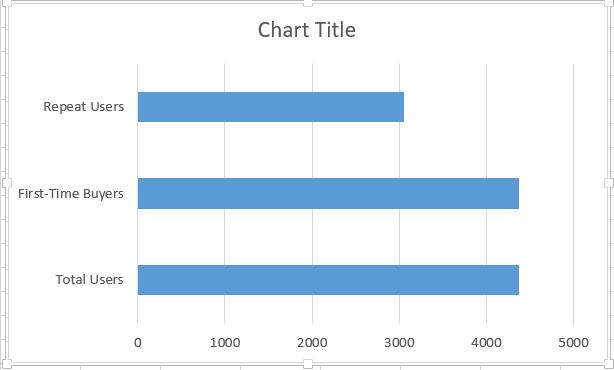

# User Activation & Retention Analysis (SQL)

## Objective
Analyzed user onboarding and retention funnel to identify conversion drop-offs and improve repeat purchase behavior for an e-commerce product.

---

## Dataset
- Source: Online Retail Dataset
- Rows: ~541,909 transactions
- Columns:
  InvoiceNo, StockCode, Description, Quantity, InvoiceDate, UnitPrice, CustomerID, Country

---

## Funnel Definition
User journey modeled as:
View → Purchase → Repeat Purchase

---

## Key Metrics

- Total Users: 4,373
- First-Time Buyers: 4,373
- Repeat Users: 3,060
- Retention Rate: 69.97%
- Drop-offs: 1,313 users
- Avg Time to Second Purchase: 191.17 days

---

## Funnel Performance
Total Users: 4,373
Users with Repeat Purchase: 3,060 (69.97% retention)
Users who did not return: 1,313 (30.03% drop-off)
Key Observation:
A significant 30% drop-off occurs after the first purchase, indicating weak post-purchase engagement.

---

## Customer Segmentation

- High Value: 2,540 users
- Medium Value: 1,618 users
- Low Value: 215 users

---

## Cohort Analysis

User retention trend (monthly cohorts):
949, 421, 380, 440, 299, 279, 235, 191, 167, 298, 352, 321, 41

---

## Revenue Insights

- Repeat User Revenue: 9,313,963

---

## Key Insights
- ~30% of users do not return after their first purchase → suggests weak post-purchase engagement or lack of retention strategies
- Average time to second purchase is 191 days → very high, indicating low product stickiness and infrequent engagement
- High-value customers contribute the majority of revenue → retaining these users is critical for growth
- Retention declines across cohorts → possible issues in early user experience or onboarding quality
- Long repeat purchase cycle → delayed revenue realization and lower customer lifetime value (LTV)

---

## Business Impact
- Reducing drop-off by 10% (~130 users) could significantly increase repeat revenue
- Faster second purchases can improve cash flow and revenue cycles
- Retaining high-value users can increase customer lifetime value (LTV)
- Small improvements in retention can lead to compounding revenue growth

---

## Experimentation / Next Steps
- A/B test personalized offers for first-time buyers
- Introduce reminder notifications to reduce time to second purchase
- Implement loyalty programs for high-value users
- Optimize post-purchase journey (emails, recommendations, re-engagement)
- Test re-engagement strategies within first 30–60 days instead of 191 days

---

## Limitations
- Dataset does not include session-level data (cannot track full onboarding funnel)
- Assumes first purchase as activation event
- No user-level behavioral or demographic data available

--- 

## Tools Used

- MySQL
- SQL (Aggregation, Joins, Cohort Analysis)

## Dataset

Due to file size limitations, the dataset is not uploaded here.

Dataset used: Online Retail II (UCI)

Source:
https://www.kaggle.com/datasets/ulrikthygepedersen/online-retail-dataset


---

## Sample SQL Queries

```sql
-- Total Users
SELECT COUNT(DISTINCT CustomerID) AS total_users
FROM ecommerce;

-- First Purchase Users
SELECT COUNT(DISTINCT CustomerID)
FROM ecommerce;

-- Repeat Users
SELECT CustomerID, COUNT(*) as orders
FROM ecommerce
GROUP BY CustomerID
HAVING COUNT(*) > 1;

-- Revenue Calculation
SELECT SUM(Quantity * UnitPrice) AS total_revenue
FROM ecommerce;

---
```

## Funnel Visualization


